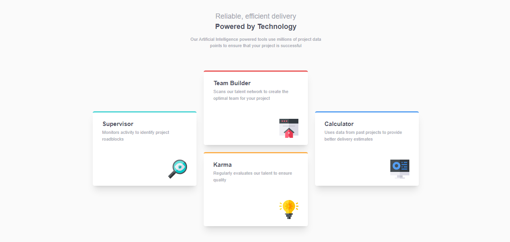

# Frontend Mentor - Four card feature section solution

This is a solution to the [Four card feature section challenge on Frontend Mentor](https://www.frontendmentor.io/challenges/four-card-feature-section-weK1eFYK). Frontend Mentor challenges help you improve your coding skills by building realistic projects. 

## Table of contents

- [Overview](#overview)
  - [The challenge](#the-challenge)
  - [Screenshot](#screenshot)
  - [Links](#links)
- [My process](#my-process)
  - [Built with](#built-with)
  - [What I learned](#what-i-learned)
- [Author](#author)

## Overview

### The challenge

Users should be able to:

- View the optimal layout for the site depending on their device's screen size

### Screenshot

### Links

- Solution URL: [Solution here](https://www.frontendmentor.io/challenges/four-card-feature-section-weK1eFYK/hub?share=true)
- Live Site URL: [Deployed to Vercel](https://four-card-feature-ten-mu.vercel.app/)

## My process

### Built with

- Semantic HTML5 markup
- CSS custom properties
- Flexbox
- CSS Grid
- Mobile-first workflow

### What I learned

Working through this project, I learned that in designing a more complex page layout, CSS Grid is my prefered option instead of CSS Flexbox.
## Author

- Frontend Mentor - [@JeremiahChinwe](https://www.frontendmentor.io/profile/JeremiahChinwe)
- Twitter - [@jeremiahchinwe](https://www.twitter.com/jeremiahchinwe)

